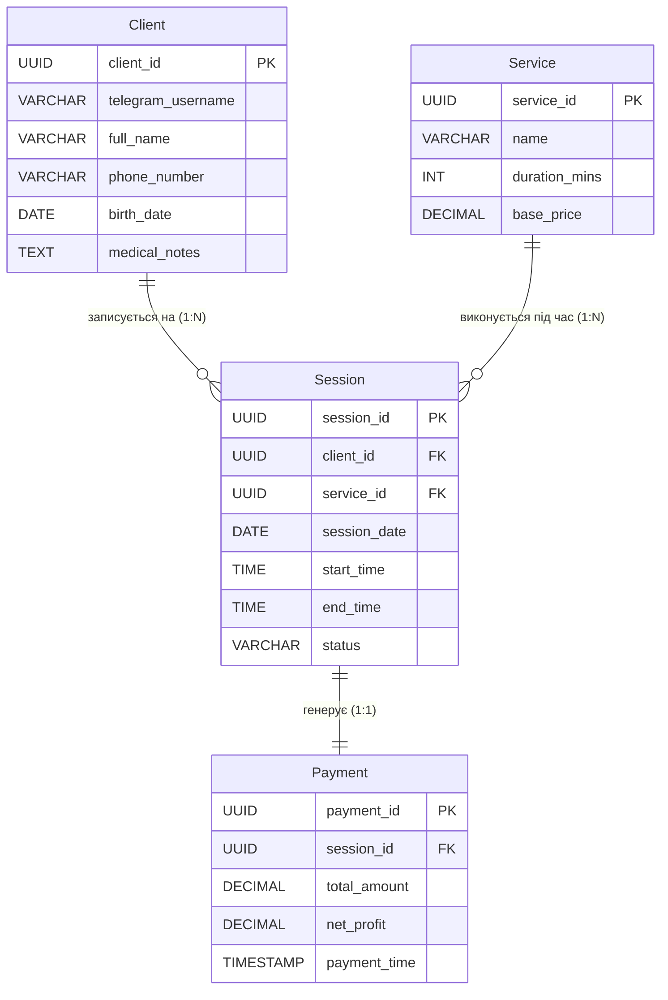

## Лабораторна робота №1. Збір вимог та розробка схеми ER

## Мета: 
Метою роботи є отримання практичних навичок збору та аналізу вимог, ключових елементів даних, бізнес-правил, завдань користувачів, створення ERD для систем на обраному прикладі (домені). 

## Завдання:
·	Зібрати та задокументувати вимоги
·	Ідентифікувати сутності та атрибути
·	Визначити зв'язки між сутностями
·	Розробити ER-діаграму
·	Сформувати обмеження

## Обраний домен: CRM-система для масажного кабінету. 

## 1.	Вимоги до системи
Призначення системи: проектується CRM-система масажного кабінету, що обслуговується одним спеціалістом. Головною метою системи є автоматизація обліку клієнтської бази, управління сеансів, ведення історії візитів з урахуванням медичних обмежень клієнтів, моніторинг фінансових метрик (доходи та чистий прибуток). БД може бути інтегрована в клієнтські застосунки (по типу інтеграції Telegram ботами, сайтами і т.д.) для простішого управління розкладом “нетехнічною” людиною.

Ключові дані для зберігання:
·	Клієнти: Система повинна зберігати ПІБ, контактну інформацію, дату народження, а також обов'язкове поле для медичних протипоказань з метою забезпечення безпеки під час процедур.
·	Послуги: Список доступних видів масажу. Для кожної послуги необхідно зберігати її назву, тривалість процедури та базову вартість.
·	Сеанси: Інформація про конкретний візит клієнта. Повинна містити дату, точний час початку та закінчення процедури, поточний статус ("заплановано", "завершено", "скасовано"), а також посилання на відповідного клієнта та обрану послугу.
·	Оплати та фінанси: Дані про розрахунки за проведені сеанси. Система має фіксувати загальну суму чека та окремо вираховувати чистий прибуток (загальна вартість мінус витрати на розхідні матеріали, комісії і т.д.).

## 2.	Сутності та атрибути

Сутність 1: Клієнт (Client).
Атрибут	Тип даних (SQL)	Опис	Ключ / Обмеження
client_id	UUID
	Унікальний ідентифікатор клієнта	PK
telegram_username	VARCHAR(50)	ID користувача у месенджері для розсилок/ботів	UNIQUE, Nullable
full_name	VARCHAR(100)	ПІБ або ім'я клієнта	NOT NULL
phone_number	VARCHAR(13)	Контактний номер телефону	UNIQUE, NOT NULL
birth_date	DATE	Дата народження	Nullable
medical_notes	TEXT	Медичні протипоказання та нотатки	Nullable

Сутність 2: Послуга (Service).
Атрибут	Тип даних (SQL)	Опис	Ключ / Обмеження
service_id	UUID	Унікальний ідентифікатор послуги	PK
name	VARCHAR(100)	Назва виду масажу (наприклад, "Спортивний")	UNIQUE, NOT NULL
duration_mins	INT	Тривалість сеансу у хвилинах	NOT NULL
base_price	DECIMAL(10,2)	Стандартна вартість послуги	NOT NULL

Сутність 3: Сеанс (Session)
Атрибут	Тип даних (SQL)	Опис	Ключ / Обмеження
session_id	UUID	Унікальний ідентифікатор запису	PK 
client_id	UUID	Посилання на клієнта, який записався	FK 
service_id	UUID	Посилання на обрану послугу	FK 
session_date	DATE	Дата проведення сеансу	NOT NULL
start_time	TIME	Час початку масажу	NOT NULL
end_time	TIME	Час закінчення масажу	NOT NULL
status	VARCHAR(15)	Статус (Scheduled, Completed, Cancelled)	NOT NULL

Сутність 4: Оплата (Payment)
Атрибут	Тип даних (SQL)	Опис	Ключ / Обмеження
payment_id	UUID	Унікальний ідентифікатор транзакції	PK 
session_id	UUID	Посилання на проведений сеанс	FK 
total_amount	DECIMAL(10,2)	Загальна сума, сплачена клієнтом	NOT NULL
net_profit	DECIMAL(10,2)	Чистий прибуток (сума мінус витрати)	NOT NULL
payment_time	TIMESTAMP	Точні дата та час розрахунку	NOT NULL

## 3.	Зв'язки між сутностями
У спроектованій БД будуть існувати наступні зв’язки:
1. Клієнт – Сеанс (Client – Session)
·	Тип зв’язку: one-to-many.
·	Опис: Один клієнт може записуватися на масажи безліч разів, але кожен сеанс закріплений лише за конкретним клієнтом. У таблиці Session це фіксується через FK client_id.
2. Послуга – Сеанс (Service – Session)
·	Тип зв’язку: one-to-many.
·	Опис: Одна конкретна послуга може закріплятися до будь-якого сеансу, але конкретний сеанс закріпляється до лише однієї послуги. У таблиці Session це прописано через FK service_id.
3. Сеанс – Оплата (Session – Payment)
·	Тип зв’язку: one-to-one
·	Опис: Конкретний сеанс може мати лише одну оплату та генерувати тільки одну транзакцію, у якій фіксується отримана сума та розраховується чистий прибуток саме за цей візит. У таблиці Payment це прописано через FK session_id (UNIQUE, щоб запобігти подвійній оплаті за один сеанс). 

## 4.	ER-діаграма

Було прийняте рішення робити ER-діаграму за допомогою Mermaid

## 5.	Обмеження до системи
Для забезпечення цілісності даних та коректної роботи логіки системи (наприклад, при майбутній інтеграції через Telegram-бота), було встановлено наступні обмеження та припущення:
1.	Один спеціаліст (відсутність перетинів розкладу): Оскільки система спроєктована для обслуговування розкладу одного масажиста, на рівні бази даних не допускається створення сеансів на одну й ту саму дату (session_date), якщо їхні часові інтервали (start_time та end_time) перетинаються.
2.	Валідація часу сеансу: Для кожного запису в таблиці Session час закінчення процедури (end_time) повинен бути строго більшим за час її початку (start_time).
3.	Обов'язковість контактів: Для успішного створення профілю в таблиці Client обов'язковою є наявність хоча б одного каналу зв'язку. Система має вимагати заповнення або номеру телефону (phone_number), або нікнейму в месенджері (telegram_username), щоб не втратити контакт із людиною.
4.	Статуси сеансів: Значення атрибута status у таблиці Session має бути обмежене чітким набором дозволених станів. Допустимі значення: “Scheduled”, “Completed”, “Cancelled”.
5.	Фінансова логіка: У таблиці Payment значення чистого прибутку (net_profit) не може перевищувати загальну суму оплати за сеанс (total_amount).

Висновок
Під час виконання лабораторної роботи було успішно проведено збір та аналіз вимог для бази даних CRM-системи масажного кабінету. В результаті виконання завдань:
1.	Проаналізовано предметну область: Визначено основні бізнес-процеси, дані для зберігання та ключові завдання, які має вирішувати система.
2.	Спроєктовано структуру даних: Ідентифіковано головні сутності (Client, Service, Session, Payment), їхні атрибути та первинні ключі.
3.	Визначено зв'язки та обмеження: Встановлено логічні зв'язки між сутностями з відповідною кардинальністю, а також сформовано набір обмежень для підтримання цілісності бази даних.
4.	Побудовано ER-модель: Створено ER-діаграму, яка наочно візуалізує архітектуру даних.
